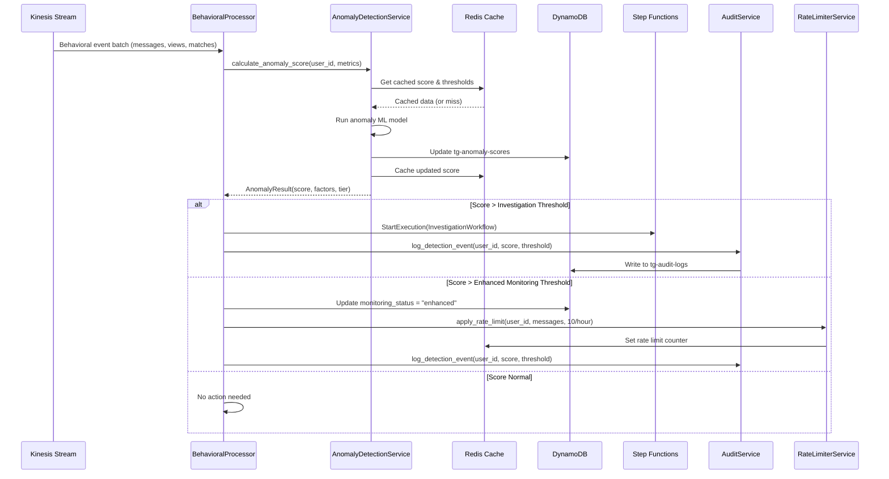
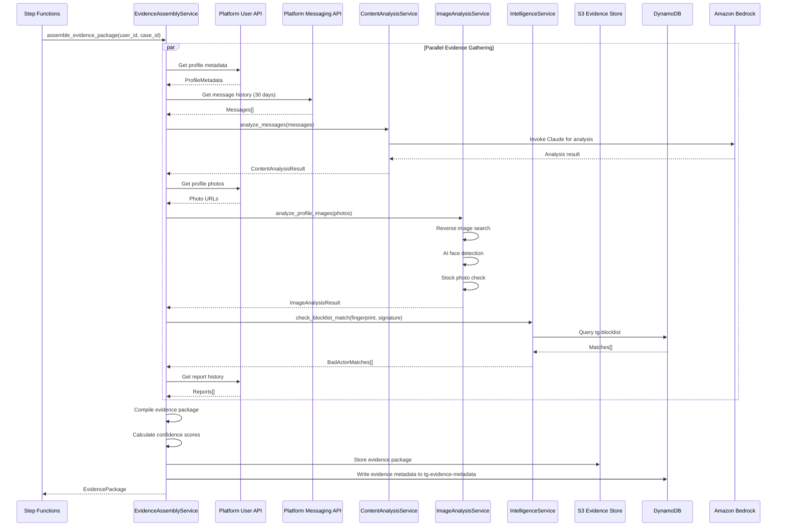
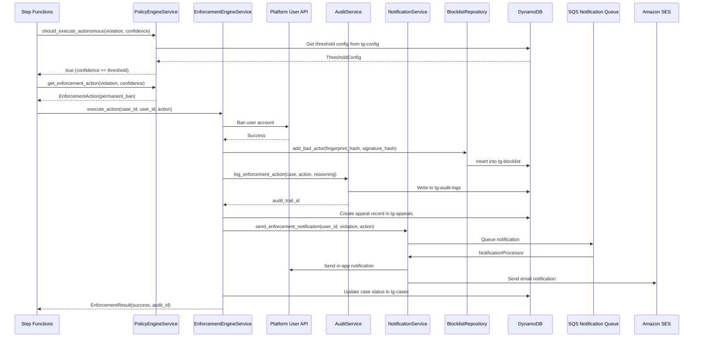
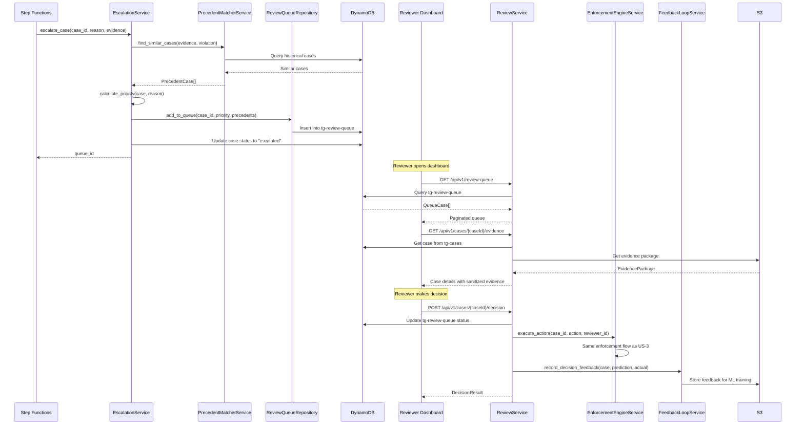
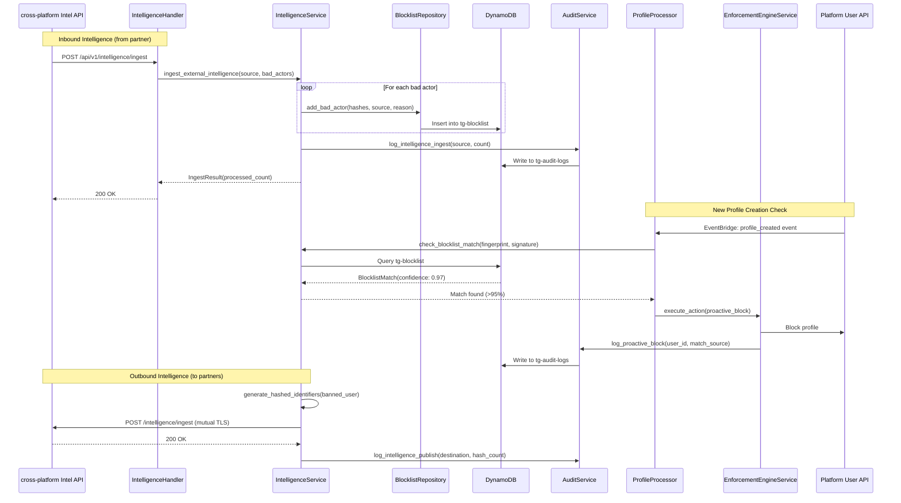
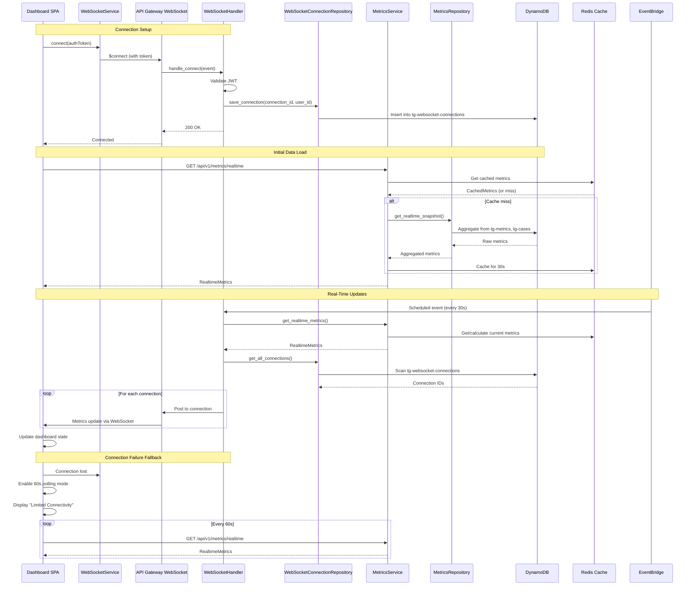
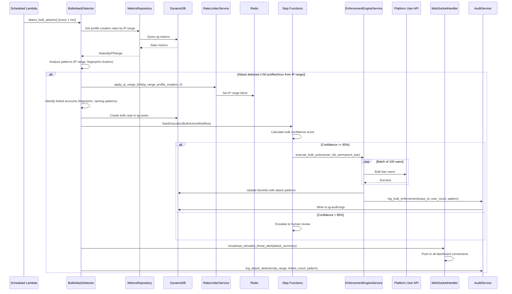
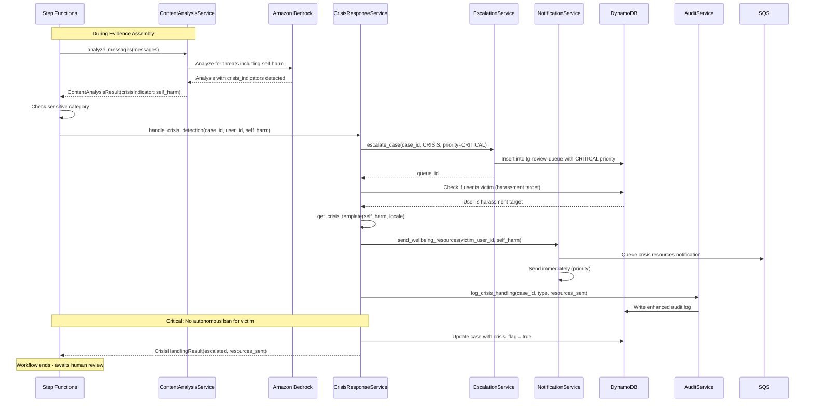

# SafetyAgent: Safety Orchestration Agent - Technical Design

## Assumptions

- **AWS Cloud Platform**: System will be deployed on AWS using serverless architecture (Lambda, DynamoDB, S3, API Gateway, Step Functions, SQS, SNS, EventBridge).
- **Python Backend**: Lambda functions will be implemented in Python 3.11+ for ML/AI capabilities and consistency with data science tooling.
- **React Frontend**: Dashboard will be a React 18+ TypeScript SPA with TailwindCSS for styling.
- **Existing Platform APIs**: Integration with existing platform services (User, Messaging, Profile, Reporting) via internal REST APIs with API keys.
- **Amazon Bedrock**: LLM capabilities for message analysis and threat detection via Amazon Bedrock (Claude models).
- **Redis ElastiCache**: Used for real-time caching, rate limiting state, and WebSocket connection management.
- **PostgreSQL RDS**: Existing user database; SafetyAgent will use DynamoDB for its own operational data.
- **Event-Driven Architecture**: Behavioral events streamed via Amazon Kinesis from the platform.
- **cross-platform API Gateway**: Cross-platform intelligence sharing via dedicated cross-platform internal API with mutual TLS.

---

## Overview

SafetyAgent is designed as an event-driven, serverless microservices architecture that processes user behavioral signals through a detection-investigation-enforcement pipeline. The system uses AWS Step Functions for orchestrating multi-step investigation workflows, DynamoDB for high-throughput operational data, and a React dashboard for real-time monitoring. The architecture emphasizes horizontal scalability, fault tolerance through circuit breakers and retry mechanisms, and complete audit trail immutability for compliance.

---

## Architecture

```
┌─────────────────────────────────────────────────────────────────────────────────────┐
│                                   FRONTEND LAYER                                     │
├─────────────────────────────────────────────────────────────────────────────────────┤
│  ┌─────────────────────────────────────────────────────────────────────────────┐   │
│  │                    React SPA (SafetyAgent Dashboard)                          │   │
│  │  ┌──────────────┐ ┌──────────────┐ ┌──────────────┐ ┌──────────────┐       │   │
│  │  │  Dashboard   │ │ Review Queue │ │ Case Details │ │   Admin      │       │   │
│  │  │   Module     │ │   Module     │ │   Module     │ │  Config      │       │   │
│  │  └──────────────┘ └──────────────┘ └──────────────┘ └──────────────┘       │   │
│  │  ┌──────────────────────────────────────────────────────────────────┐       │   │
│  │  │                    Service Layer (API Clients)                    │       │   │
│  │  └──────────────────────────────────────────────────────────────────┘       │   │
│  └─────────────────────────────────────────────────────────────────────────────┘   │
└─────────────────────────────────────────────────────────────────────────────────────┘
                                          │
                                          ▼
┌─────────────────────────────────────────────────────────────────────────────────────┐
│                                   API GATEWAY LAYER                                  │
├─────────────────────────────────────────────────────────────────────────────────────┤
│  ┌─────────────────────────────────────────────────────────────────────────────┐   │
│  │                        AWS API Gateway (REST + WebSocket)                    │   │
│  │  ┌────────────┐ ┌────────────┐ ┌────────────┐ ┌────────────┐              │   │
│  │  │  /anomalies│ │   /cases   │ │/enforcement│ │  /config   │              │   │
│  │  └────────────┘ └────────────┘ └────────────┘ └────────────┘              │   │
│  │  ┌────────────┐ ┌────────────┐ ┌────────────┐ ┌────────────┐              │   │
│  │  │ /review-   │ │/intelligence│ │  /metrics  │ │  /appeals  │              │   │
│  │  │   queue    │ │             │ │            │ │            │              │   │
│  │  └────────────┘ └────────────┘ └────────────┘ └────────────┘              │   │
│  │  ┌────────────────────────────────────────────────────────────────────┐   │   │
│  │  │              WebSocket: /dashboard/stream                           │   │   │
│  │  └────────────────────────────────────────────────────────────────────┘   │   │
│  └─────────────────────────────────────────────────────────────────────────────┘   │
└─────────────────────────────────────────────────────────────────────────────────────┘
                                          │
                                          ▼
┌─────────────────────────────────────────────────────────────────────────────────────┐
│                                COMPUTE LAYER (Lambda)                                │
├─────────────────────────────────────────────────────────────────────────────────────┤
│  ┌──────────────────────────────────────────────────────────────────────────────┐  │
│  │                        API Handler Functions                                  │  │
│  │  ┌──────────────┐ ┌──────────────┐ ┌──────────────┐ ┌──────────────┐        │  │
│  │  │  Anomaly     │ │    Case      │ │ Enforcement  │ │   Config     │        │  │
│  │  │  Handler     │ │  Handler     │ │   Handler    │ │  Handler     │        │  │
│  │  └──────────────┘ └──────────────┘ └──────────────┘ └──────────────┘        │  │
│  │  ┌──────────────┐ ┌──────────────┐ ┌──────────────┐ ┌──────────────┐        │  │
│  │  │   Review     │ │ Intelligence │ │   Metrics    │ │   Appeals    │        │  │
│  │  │   Handler    │ │   Handler    │ │   Handler    │ │   Handler    │        │  │
│  │  └──────────────┘ └──────────────┘ └──────────────┘ └──────────────┘        │  │
│  │  ┌──────────────┐ ┌──────────────┐ ┌──────────────┐                         │  │
│  │  │  WebSocket   │ │   Health     │ │   Crisis     │                         │  │
│  │  │  Handler     │ │   Handler    │ │   Handler    │                         │  │
│  │  └──────────────┘ └──────────────┘ └──────────────┘                         │  │
│  └──────────────────────────────────────────────────────────────────────────────┘  │
│                                                                                     │
│  ┌──────────────────────────────────────────────────────────────────────────────┐  │
│  │                     Event Processing Functions                                │  │
│  │  ┌──────────────┐ ┌──────────────┐ ┌──────────────┐ ┌──────────────┐        │  │
│  │  │  Behavioral  │ │   Profile    │ │   Bulk       │ │ Notification │        │  │
│  │  │  Processor   │ │  Processor   │ │  Detector    │ │   Sender     │        │  │
│  │  └──────────────┘ └──────────────┘ └──────────────┘ └──────────────┘        │  │
│  └──────────────────────────────────────────────────────────────────────────────┘  │
└─────────────────────────────────────────────────────────────────────────────────────┘
                                          │
                                          ▼
┌─────────────────────────────────────────────────────────────────────────────────────┐
│                           ORCHESTRATION LAYER (Step Functions)                       │
├─────────────────────────────────────────────────────────────────────────────────────┤
│  ┌──────────────────────────────────────────────────────────────────────────────┐  │
│  │                    Investigation Workflow State Machine                       │  │
│  │                                                                                │  │
│  │   ┌─────────┐   ┌─────────┐   ┌─────────┐   ┌─────────┐   ┌─────────┐      │  │
│  │   │ Gather  │──▶│ Analyze │──▶│Calculate│──▶│ Route   │──▶│ Execute │      │  │
│  │   │Evidence │   │ Content │   │ Score   │   │Decision │   │ Action  │      │  │
│  │   └─────────┘   └─────────┘   └─────────┘   └─────────┘   └─────────┘      │  │
│  │                                                                                │  │
│  └──────────────────────────────────────────────────────────────────────────────┘  │
│  ┌──────────────────────────────────────────────────────────────────────────────┐  │
│  │                    Bulk Action Workflow State Machine                         │  │
│  └──────────────────────────────────────────────────────────────────────────────┘  │
└─────────────────────────────────────────────────────────────────────────────────────┘
                                          │
                                          ▼
┌─────────────────────────────────────────────────────────────────────────────────────┐
│                               BUSINESS LOGIC LAYER                                   │
├─────────────────────────────────────────────────────────────────────────────────────┤
│  ┌──────────────┐ ┌──────────────┐ ┌──────────────┐ ┌──────────────┐              │
│  │  Anomaly     │ │  Evidence    │ │  Confidence  │ │ Enforcement  │              │
│  │  Detection   │ │  Assembly    │ │  Calculator  │ │   Engine     │              │
│  │  Service     │ │  Service     │ │  Service     │ │   Service    │              │
│  └──────────────┘ └──────────────┘ └──────────────┘ └──────────────┘              │
│  ┌──────────────┐ ┌──────────────┐ ┌──────────────┐ ┌──────────────┐              │
│  │   Policy     │ │  Escalation  │ │ Intelligence │ │    Audit     │              │
│  │   Engine     │ │   Service    │ │   Service    │ │   Service    │              │
│  └──────────────┘ └──────────────┘ └──────────────┘ └──────────────┘              │
│  ┌──────────────┐ ┌──────────────┐ ┌──────────────┐ ┌──────────────┐              │
│  │  Content     │ │   Crisis     │ │  Precedent   │ │   Rate       │              │
│  │  Analysis    │ │   Response   │ │   Matcher    │ │   Limiter    │              │
│  │  Service     │ │   Service    │ │   Service    │ │   Service    │              │
│  └──────────────┘ └──────────────┘ └──────────────┘ └──────────────┘              │
└─────────────────────────────────────────────────────────────────────────────────────┘
                                          │
                                          ▼
┌─────────────────────────────────────────────────────────────────────────────────────┐
│                                DATA ACCESS LAYER                                     │
├─────────────────────────────────────────────────────────────────────────────────────┤
│  ┌──────────────┐ ┌──────────────┐ ┌──────────────┐ ┌──────────────┐              │
│  │    Case      │ │  Evidence    │ │    Audit     │ │   Config     │              │
│  │ Repository   │ │ Repository   │ │ Repository   │ │ Repository   │              │
│  └──────────────┘ └──────────────┘ └──────────────┘ └──────────────┘              │
│  ┌──────────────┐ ┌──────────────┐ ┌──────────────┐ ┌──────────────┐              │
│  │   Blocklist  │ │   Review     │ │  Metrics     │ │  Reviewer    │              │
│  │ Repository   │ │   Queue      │ │ Repository   │ │ Repository   │              │
│  │              │ │ Repository   │ │              │ │              │              │
│  └──────────────┘ └──────────────┘ └──────────────┘ └──────────────┘              │
└─────────────────────────────────────────────────────────────────────────────────────┘
                                          │
                                          ▼
┌─────────────────────────────────────────────────────────────────────────────────────┐
│                                 STORAGE LAYER                                        │
├─────────────────────────────────────────────────────────────────────────────────────┤
│  ┌────────────────────────────────┐  ┌────────────────────────────────┐            │
│  │         DynamoDB Tables        │  │           S3 Buckets           │            │
│  │  ┌──────────────────────────┐ │  │  ┌──────────────────────────┐ │            │
│  │  │ tg-cases                 │ │  │  │ tg-evidence-store        │ │            │
│  │  │ tg-evidence-metadata     │ │  │  │ tg-audit-archive         │ │            │
│  │  │ tg-audit-logs            │ │  │  │ tg-config-backups        │ │            │
│  │  │ tg-blocklist             │ │  │  └──────────────────────────┘ │            │
│  │  │ tg-config                │ │  └────────────────────────────────┘            │
│  │  │ tg-review-queue          │ │                                                │
│  │  │ tg-metrics               │ │  ┌────────────────────────────────┐            │
│  │  │ tg-reviewer-state        │ │  │      Redis ElastiCache         │            │
│  │  │ tg-websocket-connections │ │  │  ┌──────────────────────────┐ │            │
│  │  │ tg-anomaly-scores        │ │  │  │ Rate limit counters      │ │            │
│  │  │ tg-appeals               │ │  │  │ WebSocket sessions       │ │            │
│  │  └──────────────────────────┘ │  │  │ Anomaly score cache      │ │            │
│  └────────────────────────────────┘  │  │ Config cache             │ │            │
│                                       │  └──────────────────────────┘ │            │
│                                       └────────────────────────────────┘            │
└─────────────────────────────────────────────────────────────────────────────────────┘
                                          │
                                          ▼
┌─────────────────────────────────────────────────────────────────────────────────────┐
│                            EXTERNAL INTEGRATIONS                                     │
├─────────────────────────────────────────────────────────────────────────────────────┤
│  ┌──────────────┐ ┌──────────────┐ ┌──────────────┐ ┌──────────────┐              │
│  │ Platform User   │ │Platform Messaging│ │ cross-platform  │ │  Amazon      │              │
│  │    API       │ │     API      │ │ Intelligence │ │  Bedrock     │              │
│  │              │ │              │ │     API      │ │              │              │
│  └──────────────┘ └──────────────┘ └──────────────┘ └──────────────┘              │
│  ┌──────────────┐ ┌──────────────┐ ┌──────────────┐ ┌──────────────┐              │
│  │  Reverse     │ │ AI Face      │ │ Stock Photo  │ │   SNS/SES    │              │
│  │ Image Search │ │ Detection    │ │  Detection   │ │(Notifications)│              │
│  │    API       │ │    API       │ │     API      │ │              │              │
│  └──────────────┘ └──────────────┘ └──────────────┘ └──────────────┘              │
│  ┌──────────────┐ ┌──────────────┐                                                │
│  │   Kinesis    │ │  CloudWatch  │                                                │
│  │(Event Stream)│ │  (Logging)   │                                                │
│  └──────────────┘ └──────────────┘                                                │
└─────────────────────────────────────────────────────────────────────────────────────┘
```

---

## Components

### Infrastructure & Configuration

#### API Gateway Configuration
**Responsibility**: Route all HTTP/WebSocket traffic to appropriate Lambda handlers with authentication, rate limiting, and request validation.

**Key Configuration**:
- REST API with resource-based routing
- WebSocket API for real-time dashboard updates
- Cognito User Pool authorizer for authentication
- Request/response validators per endpoint
- Usage plans and API keys for external integrations
- WAF integration for DDoS protection

**Endpoints**:
| Method | Path | Handler | Auth | Rate Limit |
|--------|------|---------|------|------------|
| POST | /api/v1/anomalies/analyze | AnomalyHandler | API Key | 1000/min |
| PUT | /api/v1/config/thresholds | ConfigHandler | Admin JWT + MFA | 10/min |
| GET | /api/v1/cases/{caseId}/evidence | CaseHandler | Operator JWT | 100/min |
| POST | /api/v1/enforcement/execute | EnforcementHandler | System Key | 500/min |
| POST | /api/v1/enforcement/bulk | EnforcementHandler | Admin JWT | 10/min |
| GET | /api/v1/review-queue | ReviewHandler | Reviewer JWT | 100/min |
| POST | /api/v1/cases/{caseId}/decision | ReviewHandler | Reviewer JWT | 100/min |
| POST | /api/v1/intelligence/ingest | IntelligenceHandler | mTLS | 100/min |
| POST | /api/v1/intelligence/publish | IntelligenceHandler | mTLS | 100/min |
| GET | /api/v1/metrics/realtime | MetricsHandler | Operator JWT | 60/min |
| GET | /api/v1/audit/export | AuditHandler | Admin JWT | 5/min |
| GET | /api/v1/reports/compliance | AuditHandler | Admin JWT | 10/min |
| POST | /api/v1/appeals | AppealHandler | User JWT | 10/min |
| POST | /api/v1/crisis/resources | CrisisHandler | System Key | 100/min |
| GET | /api/v1/health | HealthHandler | None | 100/min |
| GET | /api/v1/metrics | MetricsHandler | None | 100/min |
| GET | /api/v1/config/current | ConfigHandler | Admin JWT | 100/min |
| POST | /api/v1/config/rollback | ConfigHandler | Admin JWT + MFA | 5/min |
| GET | /api/v1/reviewers/{reviewerId}/exposure-metrics | ReviewerHandler | TL JWT | 100/min |
| $connect | /dashboard/stream | WebSocketHandler | Operator JWT | 1000 concurrent |
| $disconnect | /dashboard/stream | WebSocketHandler | None | - |
| $default | /dashboard/stream | WebSocketHandler | None | - |

**Satisfies**: AC-1.8, AC-1.9, AC-2.10, AC-3.6, AC-4.7, AC-4.8, AC-5.8, AC-5.9, AC-6.4, AC-6.6, AC-7.6, AC-8.7, AC-8.8, AC-9.7, AC-10.1-10.4, AC-10.8, AC-10.9, AC-11.1, AC-11.2, AC-12.7

---

#### IAM Policies and Roles
**Responsibility**: Define least-privilege access for all Lambda functions and services.

**Roles**:
- `SafetyAgentAnomalyProcessorRole`: Kinesis read, DynamoDB RW (anomaly-scores), Redis RW
- `SafetyAgentInvestigationRole`: DynamoDB RW (cases, evidence), S3 RW, Step Functions start
- `SafetyAgentEnforcementRole`: DynamoDB RW, SNS/SES publish, Platform API invoke
- `SafetyAgentAuditRole`: DynamoDB RW (audit-logs), S3 write (archive)
- `SafetyAgentConfigRole`: DynamoDB RW (config), Secrets Manager read
- `SafetyAgentExternalIntegrationRole`: API Gateway invoke, Bedrock invoke
- `SafetyAgentReviewerRole`: DynamoDB RW (review-queue, cases), S3 read (evidence)

**Satisfies**: AC-NFR-3.3, AC-NFR-3.4

---

#### CloudFormation/SAM Template Structure
**Responsibility**: Define all infrastructure as code for reproducible deployments.

**Resources Defined**:
```yaml
# template.yaml structure
Resources:
  # API Gateway
  SafetyAgentRestApi
  SafetyAgentWebSocketApi
  
  # Lambda Functions (15+)
  AnomalyHandlerFunction
  CaseHandlerFunction
  EnforcementHandlerFunction
  # ... etc
  
  # Step Functions
  InvestigationStateMachine
  BulkActionStateMachine
  
  # DynamoDB Tables (10)
  CasesTable
  EvidenceMetadataTable
  AuditLogsTable
  # ... etc
  
  # S3 Buckets
  EvidenceStoreBucket
  AuditArchiveBucket
  
  # ElastiCache
  RedisCluster
  
  # Kinesis
  BehavioralEventsStream
  
  # EventBridge
  ScheduledRules
  
  # CloudWatch
  Alarms
  Dashboards
```

**Satisfies**: AC-NFR-4.2, AC-NFR-4.3

---

#### Environment Configuration
**Responsibility**: Manage environment-specific settings and secrets.

**Configuration Sources**:
- AWS Systems Manager Parameter Store: Non-sensitive configuration
- AWS Secrets Manager: API keys, database credentials, encryption keys
- DynamoDB `tg-config` table: Runtime-configurable thresholds and policies

**Environment Variables per Lambda**:
```
ENVIRONMENT=production
LOG_LEVEL=INFO
DYNAMODB_CASES_TABLE=tg-cases-prod
S3_EVIDENCE_BUCKET=tg-evidence-store-prod
REDIS_ENDPOINT=redis-cluster.xxxxx.cache.amazonaws.com
PLATFORM_USER_API_URL=https://internal-api.example.com/users
PLATFORM_MESSAGING_API_URL=https://internal-api.example.com/messages
BEDROCK_MODEL_ID=anthropic.claude-3-sonnet
PARTNER_NETWORK_INTEL_API_URL=https://intel-api.partner-network.internal
```

**Satisfies**: AC-10.7, AC-NFR-3.1, AC-NFR-3.2

---

### Backend API / BFF Handlers

#### AnomalyHandler (`lambdas/handlers/anomaly_handler.py`)
**Responsibility**: Process anomaly analysis requests and return scores.

**Interfaces**:
```python
# POST /api/v1/anomalies/analyze
async def analyze_anomalies(event: APIGatewayEvent) -> APIGatewayResponse:
    """
    Request: { "user_ids": ["uuid1", "uuid2", ...] }
    Response: { 
        "results": [
            { "user_id": "uuid1", "anomaly_score": 0.75, "factors": [...] }
        ],
        "processing_time_ms": 245
    }
    """
```

**Dependencies**: AnomalyDetectionService, AuditService, RateLimiterService

**Satisfies**: AC-1.8, AC-1.9

---

#### CaseHandler (`lambdas/handlers/case_handler.py`)
**Responsibility**: Manage case lifecycle and evidence retrieval.

**Interfaces**:
```python
# GET /api/v1/cases/{caseId}/evidence
async def get_case_evidence(event: APIGatewayEvent) -> APIGatewayResponse:
    """
    Response: {
        "case_id": "CASE-xxx",
        "status": "investigating",
        "evidence_package": {
            "profile_metadata": {...},
            "message_analysis": {...},
            "image_analysis": {...},
            "bad_actor_matches": [...],
            "previous_reports": [...],
            "confidence_scores": {...}
        },
        "created_at": "ISO8601",
        "last_updated": "ISO8601"
    }
    """

# GET /api/v1/cases/active
async def get_active_cases(event: APIGatewayEvent) -> APIGatewayResponse:
    """Returns paginated list of active cases with status"""
```

**Dependencies**: CaseRepository, EvidenceRepository, ContentSanitizationService

**Satisfies**: AC-2.10, AC-8.6

---

#### EnforcementHandler (`lambdas/handlers/enforcement_handler.py`)
**Responsibility**: Execute enforcement actions (single and bulk).

**Interfaces**:
```python
# POST /api/v1/enforcement/execute
async def execute_enforcement(event: APIGatewayEvent) -> APIGatewayResponse:
    """
    Request: {
        "case_id": "CASE-xxx",
        "action": "temporary_suspension",
        "duration_hours": 72,
        "violation_type": "harassment",
        "confidence_score": 0.92
    }
    Response: {
        "audit_trail_id": "AUDIT-xxx",
        "action_status": "completed",
        "user_notified": true
    }
    """

# POST /api/v1/enforcement/bulk
async def execute_bulk_enforcement(event: APIGatewayEvent) -> APIGatewayResponse:
    """
    Request: {
        "case_id": "BULK-xxx",
        "user_ids": ["uuid1", ...],  # max 500
        "action": "permanent_ban",
        "violation_type": "bot_farm"
    }
    """
```

**Dependencies**: EnforcementEngineService, AuditService, NotificationService, BlocklistRepository

**Satisfies**: AC-3.6, AC-3.12, AC-9.4, AC-9.7

---

#### ReviewHandler (`lambdas/handlers/review_handler.py`)
**Responsibility**: Manage human review queue and decisions.

**Interfaces**:
```python
# GET /api/v1/review-queue
async def get_review_queue(event: APIGatewayEvent) -> APIGatewayResponse:
    """
    Query params: ?priority=high&limit=20&offset=0
    Response: {
        "cases": [...],
        "total_count": 156,
        "queue_depth_by_priority": {"critical": 5, "high": 23, ...}
    }
    """

# POST /api/v1/cases/{caseId}/decision
async def submit_decision(event: APIGatewayEvent) -> APIGatewayResponse:
    """
    Request: {
        "decision": "ban",
        "action": "permanent_ban",
        "notes": "Clear policy violation",
        "reviewer_id": "reviewer-uuid"
    }
    """
```

**Dependencies**: ReviewQueueRepository, EscalationService, EnforcementEngineService, PrecedentMatcherService

**Satisfies**: AC-4.7, AC-4.8, AC-4.9, AC-4.11

---

#### IntelligenceHandler (`lambdas/handlers/intelligence_handler.py`)
**Responsibility**: Handle cross-platform intelligence ingestion and publishing.

**Interfaces**:
```python
# POST /api/v1/intelligence/ingest
async def ingest_intelligence(event: APIGatewayEvent) -> APIGatewayResponse:
    """
    Request: {
        "source_platform": "partner_a",
        "bad_actors": [
            {
                "fingerprint_hash": "sha256:xxx",
                "behavioral_signature_hash": "sha256:yyy",
                "ban_reason": "scam",
                "ban_timestamp": "ISO8601"
            }
        ]
    }
    """

# POST /api/v1/intelligence/publish
async def publish_intelligence(event: APIGatewayEvent) -> APIGatewayResponse:
    """Publishes bad actor data to cross-platform partners"""
```

**Dependencies**: IntelligenceService, BlocklistRepository, AuditService

**Satisfies**: AC-5.8, AC-5.9

---

#### ConfigHandler (`lambdas/handlers/config_handler.py`)
**Responsibility**: Manage runtime configuration with audit trail.

**Interfaces**:
```python
# PUT /api/v1/config/thresholds
async def update_thresholds(event: APIGatewayEvent) -> APIGatewayResponse:
    """
    Request: {
        "violation_type": "harassment",
        "autonomous_threshold": 0.85,
        "investigation_trigger_threshold": 0.60
    }
    """

# GET /api/v1/config/current
async def get_current_config(event: APIGatewayEvent) -> APIGatewayResponse

# POST /api/v1/config/rollback
async def rollback_config(event: APIGatewayEvent) -> APIGatewayResponse
```

**Dependencies**: ConfigRepository, AuditService, CacheService

**Satisfies**: AC-10.1-10.9

---

#### MetricsHandler (`lambdas/handlers/metrics_handler.py`)
**Responsibility**: Serve real-time and historical metrics.

**Interfaces**:
```python
# GET /api/v1/metrics/realtime
async def get_realtime_metrics(event: APIGatewayEvent) -> APIGatewayResponse:
    """
    Response: {
        "platform_safety_score": 94.2,
        "cases_processed_today": 12453,
        "autonomous_resolution_rate": 0.76,
        "avg_resolution_time_minutes": 12.3,
        "review_queue_depth": 145,
        "threat_distribution": {...}
    }
    """

# GET /api/v1/metrics (Prometheus format)
async def get_prometheus_metrics(event: APIGatewayEvent) -> str

# GET /api/v1/actions/recent
async def get_recent_actions(event: APIGatewayEvent) -> APIGatewayResponse
```

**Dependencies**: MetricsRepository, CacheService

**Satisfies**: AC-8.8, AC-11.2

---

#### WebSocketHandler (`lambdas/handlers/websocket_handler.py`)
**Responsibility**: Manage WebSocket connections for real-time dashboard updates.

**Interfaces**:
```python
async def handle_connect(event: WebSocketEvent) -> Response
async def handle_disconnect(event: WebSocketEvent) -> Response
async def handle_message(event: WebSocketEvent) -> Response
async def broadcast_metrics_update(metrics: RealtimeMetrics) -> None
```

**Dependencies**: WebSocketConnectionRepository, MetricsService

**Satisfies**: AC-8.7, AC-8.12

---

#### HealthHandler (`lambdas/handlers/health_handler.py`)
**Responsibility**: Report system health status.

**Interfaces**:
```python
# GET /api/v1/health
async def health_check(event: APIGatewayEvent) -> APIGatewayResponse:
    """
    Response: {
        "status": "healthy",
        "components": {
            "dynamodb": {"status": "healthy", "latency_ms": 12},
            "redis": {"status": "healthy", "latency_ms": 3},
            "platform_api": {"status": "healthy", "latency_ms": 45},
            "bedrock": {"status": "degraded", "latency_ms": 890}
        },
        "timestamp": "ISO8601"
    }
    """
```

**Satisfies**: AC-11.1

---

#### AppealHandler (`lambdas/handlers/appeal_handler.py`)
**Responsibility**: Process user appeal submissions.

**Interfaces**:
```python
# POST /api/v1/appeals
async def submit_appeal(event: APIGatewayEvent) -> APIGatewayResponse:
    """
    Request: {
        "enforcement_id": "ENF-xxx",
        "appeal_reason": "I did not violate the policy because...",
        "supporting_info": "..."
    }
    Response: {
        "appeal_id": "APPEAL-xxx",
        "status": "received",
        "expected_review_time": "24-48 hours"
    }
    """
```

**Dependencies**: AppealRepository, CaseRepository, EscalationService

**Satisfies**: AC-4.3, AC-12.6, AC-12.7

---

#### CrisisHandler (`lambdas/handlers/crisis_handler.py`)
**Responsibility**: Handle crisis response resource delivery.

**Interfaces**:
```python
# POST /api/v1/crisis/resources
async def send_crisis_resources(event: APIGatewayEvent) -> APIGatewayResponse:
    """
    Request: {
        "user_id": "uuid",
        "crisis_type": "self_harm",
        "case_id": "CASE-xxx"
    }
    """
```

**Dependencies**: CrisisResponseService, NotificationService, AuditService

**Satisfies**: AC-13.5

---

#### AuditHandler (`lambdas/handlers/audit_handler.py`)
**Responsibility**: Export audit data and compliance reports.

**Interfaces**:
```python
# GET /api/v1/audit/export
async def export_audit(event: APIGatewayEvent) -> APIGatewayResponse:
    """
    Query params: ?start_date=2024-01-01&end_date=2024-01-31&format=json
    Response: S3 presigned URL for download
    """

# GET /api/v1/reports/compliance
async def get_compliance_report(event: APIGatewayEvent) -> APIGatewayResponse:
    """
    Response: {
        "period": {"start": "ISO8601", "end": "ISO8601"},
        "total_cases": 145632,
        "resolution_times": {"avg_minutes": 14.2, "p50": 8, "p90": 32, "p99": 89},
        "autonomous_rate": 0.76,
        "violation_breakdown": {...},
        "appeal_rates": {...},
        "jurisdiction_breakdown": {...}
    }
    """
```

**Dependencies**: AuditRepository, MetricsRepository

**Satisfies**: AC-6.4, AC-6.5, AC-6.6, AC-6.10

---

#### ReviewerHandler (`lambdas/handlers/reviewer_handler.py`)
**Responsibility**: Manage reviewer state and exposure metrics.

**Interfaces**:
```python
# GET /api/v1/reviewers/{reviewerId}/exposure-metrics
async def get_exposure_metrics(event: APIGatewayEvent) -> APIGatewayResponse:
    """
    Response: {
        "reviewer_id": "uuid",
        "today": {
            "cases_reviewed": 45,
            "harmful_content_exposure": 12,
            "time_on_sensitive_cases_minutes": 34
        },
        "this_week": {...},
        "exposure_threshold_reached": false
    }
    """
```

**Dependencies**: ReviewerRepository

**Satisfies**: AC-7.6

---

### Event Processing Functions

#### BehavioralEventProcessor (`lambdas/processors/behavioral_processor.py`)
**Responsibility**: Process Kinesis stream of user behavioral events, update anomaly scores.

**Trigger**: Kinesis stream `behavioral-events`

**Interfaces**:
```python
async def process_behavioral_events(event: KinesisEvent) -> None:
    """
    Processes batch of behavioral events (message sends, profile views, matches).
    Updates anomaly scores in DynamoDB and Redis cache.
    Triggers investigations when thresholds exceeded.
    """
```

**Dependencies**: AnomalyDetectionService, CaseRepository, RateLimiterService, AuditService

**Satisfies**: AC-1.1, AC-1.2, AC-1.3, AC-1.4, AC-1.5, AC-1.6, AC-1.7, AC-1.10

---

#### ProfileCreationProcessor (`lambdas/processors/profile_processor.py`)
**Responsibility**: Process new profile creation events, check against blocklist.

**Trigger**: EventBridge rule for profile creation events

**Interfaces**:
```python
async def process_profile_creation(event: EventBridgeEvent) -> None:
    """
    On new profile creation:
    1. Check device fingerprint against blocklist
    2. Check behavioral signature against known patterns
    3. Apply proactive block or enhanced scrutiny as appropriate
    """
```

**Dependencies**: IntelligenceService, BlocklistRepository, EnforcementEngineService, AuditService

**Satisfies**: AC-5.4, AC-5.5, AC-5.6, AC-5.7

---

#### BulkAttackDetector (`lambdas/processors/bulk_detector.py`)
**Responsibility**: Detect coordinated bulk attacks and trigger response.

**Trigger**: Scheduled (every 1 minute) + EventBridge high-volume alerts

**Interfaces**:
```python
async def detect_bulk_attacks(event: ScheduledEvent) -> None:
    """
    Analyzes profile creation patterns, IP ranges, device fingerprints.
    Triggers bulk investigation workflow when attack detected.
    """
```

**Dependencies**: MetricsRepository, CaseRepository, RateLimiterService

**Satisfies**: AC-9.1, AC-9.2, AC-9.3, AC-9.6, AC-9.8

---

#### NotificationProcessor (`lambdas/processors/notification_processor.py`)
**Responsibility**: Process notification queue and send user communications.

**Trigger**: SQS queue `notification-queue`

**Interfaces**:
```python
async def process_notifications(event: SQSEvent) -> None:
    """
    Sends in-app notifications via Platform API.
    Sends email notifications via SES.
    Tracks delivery status.
    """
```

**Dependencies**: NotificationService, PlatformUserAPI, AuditService

**Satisfies**: AC-3.3, AC-12.1, AC-12.2, AC-12.3, AC-12.4, AC-12.5, AC-12.8, AC-12.9

---

### Orchestration (Step Functions)

#### InvestigationWorkflow (`statemachines/investigation_workflow.asl.json`)
**Responsibility**: Orchestrate multi-step investigation process.

**States**:
1. **GatherProfileMetadata**: Retrieve user profile and device info
2. **GatherMessageHistory**: Fetch and store messages for analysis
3. **AnalyzeMessages**: Run sentiment, threat, and scam detection
4. **AnalyzeImages**: Run reverse image search, AI detection
5. **CheckBadActorPatterns**: Cross-reference with blocklist
6. **GatherPreviousReports**: Retrieve report history
7. **CalculateConfidenceScores**: Compute weighted violation scores
8. **CheckSensitiveCategories**: Determine if crisis/sensitive
9. **RouteDecision**: Branch to autonomous or human review
10. **ExecuteAutonomousAction**: Perform enforcement
11. **EscalateToHumanReview**: Add to review queue

**Parallel Execution**: Steps 2-6 run in parallel for performance.

**Error Handling**: 
- Retry with exponential backoff on transient failures
- Continue with partial evidence on non-critical source failures
- Escalate to human review on persistent failures

**Satisfies**: AC-2.1-AC-2.9, AC-2.12, AC-3.1, AC-3.8, AC-4.1, AC-4.2, AC-4.4, AC-13.1, AC-13.2, AC-13.8

---

#### BulkActionWorkflow (`statemachines/bulk_action_workflow.asl.json`)
**Responsibility**: Orchestrate bulk enforcement actions.

**States**:
1. **IdentifyLinkedAccounts**: Find all accounts matching attack pattern
2. **ValidateConfidence**: Check confidence meets bulk action threshold
3. **RouteByConfidence**: Branch to auto or human review
4. **ExecuteBulkAction**: Process accounts in batches
5. **UpdateBlocklist**: Add patterns to detection filters
6. **NotifyOperations**: Send dashboard alerts

**Satisfies**: AC-9.3, AC-9.4, AC-9.5, AC-9.9

---

### Business Logic / Services

#### AnomalyDetectionService (`services/anomaly_detection_service.py`)
**Responsibility**: Calculate behavioral anomaly scores using ML model.

**Interfaces**:
```python
class AnomalyDetectionService:
    async def calculate_anomaly_score(
        self, 
        user_id: str,
        behavioral_metrics: BehavioralMetrics
    ) -> AnomalyResult:
        """
        Returns: AnomalyResult with score (0-1), contributing factors, 
        and applicable tier threshold
        """
    
    async def get_account_tier_thresholds(
        self, 
        account_age_days: int
    ) -> TierThresholds:
        """Returns appropriate thresholds based on account age"""
    
    async def batch_calculate_scores(
        self,
        user_metrics: List[Tuple[str, BehavioralMetrics]]
    ) -> List[AnomalyResult]:
        """Batch processing for efficiency"""
```

**Dependencies**: ConfigRepository (thresholds), Redis cache, ML model (SageMaker endpoint)

**Satisfies**: AC-1.1, AC-1.2, AC-1.3, AC-1.10

---

#### EvidenceAssemblyService (`services/evidence_assembly_service.py`)
**Responsibility**: Coordinate evidence gathering from multiple sources.

**Interfaces**:
```python
class EvidenceAssemblyService:
    async def assemble_evidence_package(
        self,
        user_id: str,
        case_id: str
    ) -> EvidencePackage:
        """
        Gathers all evidence, handles partial failures,
        stores in S3, returns structured package
        """
    
    async def gather_profile_metadata(self, user_id: str) -> ProfileMetadata
    async def gather_message_history(self, user_id: str, days: int = 30) -> MessageHistory
    async def gather_previous_reports(self, user_id: str) -> List[Report]
```

**Dependencies**: 
- PlatformUserAPI, PlatformMessagingAPI
- ContentAnalysisService, ImageAnalysisService
- IntelligenceService, BlocklistRepository
- EvidenceRepository (S3)

**Satisfies**: AC-2.1-AC-2.9

---

#### ContentAnalysisService (`services/content_analysis_service.py`)
**Responsibility**: Analyze message content for policy violations using LLM.

**Interfaces**:
```python
class ContentAnalysisService:
    async def analyze_messages(
        self,
        messages: List[Message]
    ) -> ContentAnalysisResult:
        """
        Returns: Sentiment scores, threat indicators, 
        scam pattern matches, self-harm indicators
        """
    
    async def detect_scam_patterns(self, content: str) -> List[ScamPattern]
    async def detect_threat_indicators(self, content: str) -> List[ThreatIndicator]
    async def detect_crisis_indicators(self, content: str) -> Optional[CrisisIndicator]
```

**Dependencies**: Amazon Bedrock (Claude), scam pattern database

**Satisfies**: AC-2.2, AC-13.1

---

#### ImageAnalysisService (`services/image_analysis_service.py`)
**Responsibility**: Analyze profile images for authenticity.

**Interfaces**:
```python
class ImageAnalysisService:
    async def analyze_profile_images(
        self,
        image_urls: List[str]
    ) -> ImageAnalysisResult:
        """
        Returns: Reverse image matches, AI generation probability,
        stock photo matches
        """
```

**Dependencies**: ReverseImageSearchAPI, AIFaceDetectionAPI, StockPhotoAPI

**Satisfies**: AC-2.3, AC-2.4

---

#### ConfidenceCalculatorService (`services/confidence_calculator_service.py`)
**Responsibility**: Calculate weighted confidence scores per violation type.

**Interfaces**:
```python
class ConfidenceCalculatorService:
    async def calculate_confidence_scores(
        self,
        evidence_package: EvidencePackage
    ) -> Dict[ViolationType, float]:
        """
        Returns confidence scores (0-1) for each violation type
        using configurable weighted algorithm
        """
    
    async def get_primary_violation(
        self,
        scores: Dict[ViolationType, float]
    ) -> Tuple[ViolationType, float]:
        """Returns highest-confidence violation"""
```

**Dependencies**: ConfigRepository (weights), PolicyEngineService

**Satisfies**: AC-2.7, AC-2.12

---

#### PolicyEngineService (`services/policy_engine_service.py`)
**Responsibility**: Map violations to enforcement actions based on policy rules.

**Interfaces**:
```python
class PolicyEngineService:
    async def get_enforcement_action(
        self,
        violation_type: ViolationType,
        confidence_score: float,
        is_repeat_offender: bool
    ) -> EnforcementAction:
        """Returns appropriate action based on policy rules"""
    
    async def should_escalate_to_human(
        self,
        violation_type: ViolationType,
        confidence_score: float,
        has_sensitive_category: bool
    ) -> bool:
        """Determines if case needs human review"""
    
    async def get_autonomous_threshold(
        self,
        violation_type: ViolationType
    ) -> float:
        """Returns threshold for autonomous action"""
```

**Dependencies**: ConfigRepository

**Satisfies**: AC-3.1, AC-3.7, AC-4.1

---

#### EnforcementEngineService (`services/enforcement_engine_service.py`)
**Responsibility**: Execute enforcement actions with retry and audit logging.

**Interfaces**:
```python
class EnforcementEngineService:
    async def execute_action(
        self,
        case_id: str,
        user_id: str,
        action: EnforcementAction,
        violation_type: ViolationType,
        confidence_score: float,
        is_autonomous: bool
    ) -> EnforcementResult:
        """
        Executes action, logs to audit, triggers notification,
        updates blocklist if permanent ban
        """
    
    async def execute_bulk_action(
        self,
        case_id: str,
        user_ids: List[str],
        action: EnforcementAction
    ) -> BulkEnforcementResult
```

**Dependencies**: PlatformUserAPI, BlocklistRepository, AuditService, NotificationService, AppealRepository

**Satisfies**: AC-3.2, AC-3.3, AC-3.4, AC-3.5, AC-3.8, AC-3.9, AC-3.12, AC-9.4, AC-9.5

---

#### EscalationService (`services/escalation_service.py`)
**Responsibility**: Route cases to human review queue with context.

**Interfaces**:
```python
class EscalationService:
    async def escalate_case(
        self,
        case_id: str,
        reason: EscalationReason,
        evidence_package: EvidencePackage,
        confidence_scores: Dict[ViolationType, float]
    ) -> str:  # review_queue_id
        """
        Adds case to review queue with:
        - Pre-assembled evidence
        - Policy recommendations
        - Similar case precedents
        - Priority score
        """
    
    async def calculate_priority(
        self,
        case: Case,
        escalation_reason: EscalationReason
    ) -> Priority
    
    async def check_queue_age_alerts(self) -> List[Alert]
```

**Dependencies**: ReviewQueueRepository, PrecedentMatcherService, ConfigRepository

**Satisfies**: AC-4.1, AC-4.2, AC-4.3, AC-4.4, AC-4.5, AC-4.13

---

#### IntelligenceService (`services/intelligence_service.py`)
**Responsibility**: Manage cross-platform bad actor intelligence.

**Interfaces**:
```python
class IntelligenceService:
    async def check_blocklist_match(
        self,
        device_fingerprint: str,
        behavioral_signature: str
    ) -> Optional[BlocklistMatch]:
        """Returns match details if found, with confidence score"""
    
    async def ingest_external_intelligence(
        self,
        source_platform: str,
        bad_actors: List[BadActorRecord]
    ) -> IngestResult
    
    async def publish_bad_actor(
        self,
        user_id: str,
        fingerprint_hash: str,
        signature_hash: str,
        ban_reason: str
    ) -> PublishResult
    
    async def generate_fingerprint_hash(self, fingerprint: dict) -> str
    async def generate_behavioral_signature_hash(self, signature: dict) -> str
```

**Dependencies**: BlocklistRepository, PartnerIntelAPI, AuditService

**Satisfies**: AC-5.1-AC-5.11

---

#### AuditService (`services/audit_service.py`)
**Responsibility**: Log all actions immutably with full context.

**Interfaces**:
```python
class AuditService:
    async def log_enforcement_action(
        self,
        case_id: str,
        user_id: str,
        action: EnforcementAction,
        violation_type: ViolationType,
        confidence_score: float,
        decision_source: DecisionSource,
        reasoning: str
    ) -> str:  # audit_id
    
    async def log_config_change(
        self,
        admin_id: str,
        config_key: str,
        previous_value: Any,
        new_value: Any
    ) -> str
    
    async def log_detection_event(
        self,
        user_id: str,
        anomaly_type: str,
        score: float,
        threshold: float
    ) -> str
    
    async def export_audit_logs(
        self,
        start_date: datetime,
        end_date: datetime,
        format: str  # 'json' or 'csv'
    ) -> str:  # S3 presigned URL
```

**Dependencies**: AuditRepository, S3 (archive)

**Satisfies**: AC-1.5, AC-3.4, AC-5.7, AC-6.1-AC-6.10, AC-10.6, AC-13.7

---

#### CrisisResponseService (`services/crisis_response_service.py`)
**Responsibility**: Handle crisis cases with appropriate resources.

**Interfaces**:
```python
class CrisisResponseService:
    async def handle_crisis_detection(
        self,
        case_id: str,
        user_id: str,
        crisis_type: CrisisType
    ) -> CrisisHandlingResult:
        """
        Escalates to priority review, optionally sends resources to victim
        """
    
    async def send_wellbeing_resources(
        self,
        user_id: str,
        crisis_type: CrisisType
    ) -> None
    
    async def get_crisis_template(
        self,
        crisis_type: CrisisType,
        locale: str
    ) -> CrisisTemplate
```

**Dependencies**: NotificationService, ConfigRepository, EscalationService

**Satisfies**: AC-13.1-AC-13.8

---

#### PrecedentMatcherService (`services/precedent_matcher_service.py`)
**Responsibility**: Find similar historical cases for reviewer context.

**Interfaces**:
```python
class PrecedentMatcherService:
    async def find_similar_cases(
        self,
        evidence_package: EvidencePackage,
        violation_type: ViolationType,
        limit: int = 5
    ) -> List[PrecedentCase]:
        """
        Returns similar cases with their outcomes for reviewer reference
        """
```

**Dependencies**: CaseRepository, ML embeddings model

**Satisfies**: AC-4.6

---

#### RateLimiterService (`services/rate_limiter_service.py`)
**Responsibility**: Manage rate limiting for flagged accounts and IP ranges.

**Interfaces**:
```python
class RateLimiterService:
    async def apply_rate_limit(
        self,
        user_id: str,
        limit_type: RateLimitType,  # message, profile_creation, etc.
        max_per_hour: int
    ) -> None
    
    async def apply_ip_range_limit(
        self,
        ip_range: str,
        limit_type: RateLimitType,
        max_per_hour: int
    ) -> None
    
    async def check_rate_limit(
        self,
        user_id: str,
        limit_type: RateLimitType
    ) -> RateLimitStatus
    
    async def remove_rate_limit(
        self,
        user_id: str,
        limit_type: RateLimitType
    ) -> None
```

**Dependencies**: Redis ElastiCache

**Satisfies**: AC-1.4, AC-9.2, AC-10.4

---

#### NotificationService (`services/notification_service.py`)
**Responsibility**: Send user notifications across channels.

**Interfaces**:
```python
class NotificationService:
    async def send_enforcement_notification(
        self,
        user_id: str,
        enforcement_id: str,
        violation_type: ViolationType,
        action: EnforcementAction,
        appeal_instructions: str,
        locale: str
    ) -> NotificationResult
    
    async def send_appeal_acknowledgment(
        self,
        user_id: str,
        appeal_id: str,
        expected_review_time: str
    ) -> NotificationResult
    
    async def get_notification_template(
        self,
        violation_type: ViolationType,
        action: EnforcementAction,
        locale: str
    ) -> NotificationTemplate
```

**Dependencies**: PlatformNotificationAPI, SES, ConfigRepository (templates)

**Satisfies**: AC-12.1-AC-12.5, AC-12.8, AC-12.9

---

#### ContentSanitizationService (`services/content_sanitization_service.py`)
**Responsibility**: Filter explicit content before human exposure.

**Interfaces**:
```python
class ContentSanitizationService:
    async def sanitize_evidence_package(
        self,
        evidence_package: EvidencePackage,
        reviewer_preference: ContentVisibility
    ) -> SanitizedEvidencePackage:
        """
        Replaces explicit content with labels based on reviewer preference
        """
    
    async def classify_content_severity(
        self,
        content: str
    ) -> ContentSeverity:  # Low, Medium, High, Critical
```

**Dependencies**: Amazon Bedrock, ConfigRepository

**Satisfies**: AC-7.1, AC-7.2, AC-7.3, AC-7.7

---

#### ReviewerWellbeingService (`services/reviewer_wellbeing_service.py`)
**Responsibility**: Track and protect reviewer exposure to harmful content.

**Interfaces**:
```python
class ReviewerWellbeingService:
    async def track_exposure(
        self,
        reviewer_id: str,
        case_id: str,
        content_severity: ContentSeverity
    ) -> None
    
    async def check_exposure_threshold(
        self,
        reviewer_id: str
    ) -> ExposureStatus:
        """Returns whether reviewer should take a break"""
    
    async def get_exposure_metrics(
        self,
        reviewer_id: str,
        period: TimePeriod
    ) -> ExposureMetrics
    
    async def distribute_critical_case(
        self,
        case_id: str,
        reviewers: List[str]
    ) -> str:  # assigned_reviewer_id
```

**Dependencies**: ReviewerRepository

**Satisfies**: AC-7.4, AC-7.5, AC-7.7, AC-7.8

---

#### MetricsAggregationService (`services/metrics_aggregation_service.py`)
**Responsibility**: Aggregate and calculate real-time metrics.

**Interfaces**:
```python
class MetricsAggregationService:
    async def get_realtime_metrics(self) -> RealtimeMetrics
    async def get_platform_safety_score(self) -> float
    async def get_autonomous_resolution_rate(self) -> float
    async def get_threat_distribution(self) -> Dict[str, int]
    async def check_elevated_threat_level(self) -> bool
    async def generate_compliance_report(
        self,
        start_date: datetime,
        end_date: datetime
    ) -> ComplianceReport
```

**Dependencies**: MetricsRepository, CacheService

**Satisfies**: AC-8.1-AC-8.5, AC-8.10, AC-6.5, AC-3.10, AC-9.10

---

#### CircuitBreakerService (`services/circuit_breaker_service.py`)
**Responsibility**: Implement circuit breaker pattern for external services.

**Interfaces**:
```python
class CircuitBreakerService:
    async def call_with_breaker(
        self,
        service_name: str,
        callable: Callable,
        *args, **kwargs
    ) -> Any:
        """
        Wraps external calls with circuit breaker logic.
        Opens circuit after 5 failures, closes after timeout.
        """
    
    async def get_circuit_status(
        self,
        service_name: str
    ) -> CircuitStatus:  # closed, open, half-open
```

**Dependencies**: Redis (state)

**Satisfies**: AC-11.8, AC-11.9

---

#### FeedbackLoopService (`services/feedback_loop_service.py`)
**Responsibility**: Feed reviewer decisions back to ML model training.

**Interfaces**:
```python
class FeedbackLoopService:
    async def record_decision_feedback(
        self,
        case_id: str,
        predicted_violation: ViolationType,
        predicted_confidence: float,
        actual_decision: Decision,
        reviewer_id: str
    ) -> None
    
    async def export_training_data(
        self,
        since: datetime
    ) -> str:  # S3 URI
```

**Dependencies**: S3, SageMaker

**Satisfies**: AC-4.10

---

### Data Access Layer

#### CaseRepository (`repositories/case_repository.py`)
**Responsibility**: CRUD operations for investigation cases.

**Interfaces**:
```python
class CaseRepository:
    async def create_case(self, case: Case) -> str
    async def get_case(self, case_id: str) -> Optional[Case]
    async def update_case_status(self, case_id: str, status: CaseStatus) -> None
    async def get_active_cases(self, limit: int, offset: int) -> List[Case]
    async def get_cases_by_user(self, user_id: str) -> List[Case]
    async def get_cases_by_status(self, status: CaseStatus) -> List[Case]
```

**Dependencies**: DynamoDB `tg-cases` table

**Satisfies**: AC-2.8

---

#### EvidenceRepository (`repositories/evidence_repository.py`)
**Responsibility**: Store and retrieve evidence packages.

**Interfaces**:
```python
class EvidenceRepository:
    async def store_evidence(
        self,
        case_id: str,
        evidence: EvidencePackage
    ) -> str:  # S3 key
    
    async def get_evidence(self, case_id: str) -> EvidencePackage
    async def get_evidence_metadata(self, case_id: str) -> EvidenceMetadata
```

**Dependencies**: S3 `tg-evidence-store`, DynamoDB `tg-evidence-metadata`

**Satisfies**: AC-2.8

---

#### AuditRepository (`repositories/audit_repository.py`)
**Responsibility**: Immutable storage for audit logs.

**Interfaces**:
```python
class AuditRepository:
    async def write_log(self, log_entry: AuditLogEntry) -> str
    async def query_logs(
        self,
        filters: AuditQueryFilters,
        limit: int,
        offset: int
    ) -> List[AuditLogEntry]
    async def export_to_s3(
        self,
        query_filters: AuditQueryFilters,
        format: str
    ) -> str  # presigned URL
```

**Dependencies**: DynamoDB `tg-audit-logs`, S3 `tg-audit-archive`

**Satisfies**: AC-6.3, AC-6.7, AC-6.8

---

#### ConfigRepository (`repositories/config_repository.py`)
**Responsibility**: Manage runtime configuration with versioning.

**Interfaces**:
```python
class ConfigRepository:
    async def get_config(self, key: str) -> ConfigValue
    async def get_all_configs(self) -> Dict[str, ConfigValue]
    async def update_config(
        self,
        key: str,
        value: Any,
        admin_id: str
    ) -> str:  # version_id
    async def get_config_history(self, key: str) -> List[ConfigVersion]
    async def rollback_config(self, key: str, version_id: str) -> None
```

**Dependencies**: DynamoDB `tg-config`, S3 `tg-config-backups`

**Satisfies**: AC-10.5, AC-10.6, AC-10.7, AC-10.8

---

#### BlocklistRepository (`repositories/blocklist_repository.py`)
**Responsibility**: Manage cross-platform bad actor blocklist.

**Interfaces**:
```python
class BlocklistRepository:
    async def add_bad_actor(
        self,
        fingerprint_hash: str,
        signature_hash: str,
        source: str,
        ban_reason: str
    ) -> None
    
    async def check_fingerprint(
        self,
        fingerprint_hash: str
    ) -> Optional[BlocklistEntry]
    
    async def check_signature(
        self,
        signature_hash: str
    ) -> Optional[BlocklistEntry]
    
    async def get_recent_additions(
        self,
        since: datetime
    ) -> List[BlocklistEntry]
```

**Dependencies**: DynamoDB `tg-blocklist`

**Satisfies**: AC-5.1

---

#### ReviewQueueRepository (`repositories/review_queue_repository.py`)
**Responsibility**: Manage human review queue.

**Interfaces**:
```python
class ReviewQueueRepository:
    async def add_to_queue(
        self,
        case_id: str,
        priority: Priority,
        escalation_reason: EscalationReason
    ) -> str
    
    async def get_queue(
        self,
        priority_filter: Optional[Priority],
        limit: int,
        offset: int
    ) -> List[QueueEntry]
    
    async def get_queue_depth(self) -> Dict[Priority, int]
    async def assign_case(self, queue_id: str, reviewer_id: str) -> None
    async def complete_review(self, queue_id: str, decision: Decision) -> None
    async def get_stale_cases(self, older_than_hours: int) -> List[QueueEntry]
```

**Dependencies**: DynamoDB `tg-review-queue`

**Satisfies**: AC-4.7, AC-4.13

---

#### MetricsRepository (`repositories/metrics_repository.py`)
**Responsibility**: Store and query operational metrics.

**Interfaces**:
```python
class MetricsRepository:
    async def record_metric(
        self,
        metric_name: str,
        value: float,
        dimensions: Dict[str, str]
    ) -> None
    
    async def get_metric_aggregates(
        self,
        metric_name: str,
        period: TimePeriod,
        aggregation: str  # 'sum', 'avg', 'p50', 'p90', 'p99'
    ) -> MetricAggregate
    
    async def get_realtime_snapshot(self) -> Dict[str, Any]
```

**Dependencies**: DynamoDB `tg-metrics`, CloudWatch

**Satisfies**: AC-8.1, AC-8.2, AC-11.5, AC-11.6

---

#### ReviewerRepository (`repositories/reviewer_repository.py`)
**Responsibility**: Manage reviewer state and exposure tracking.

**Interfaces**:
```python
class ReviewerRepository:
    async def get_reviewer(self, reviewer_id: str) -> Reviewer
    async def update_exposure_count(
        self,
        reviewer_id: str,
        severity: ContentSeverity
    ) -> None
    async def get_exposure_metrics(
        self,
        reviewer_id: str,
        since: datetime
    ) -> ExposureMetrics
    async def set_content_preference(
        self,
        reviewer_id: str,
        preference: ContentVisibility
    ) -> None
```

**Dependencies**: DynamoDB `tg-reviewer-state`

**Satisfies**: AC-7.4, AC-7.8

---

#### AppealRepository (`repositories/appeal_repository.py`)
**Responsibility**: Manage user appeals.

**Interfaces**:
```python
class AppealRepository:
    async def create_appeal(self, appeal: Appeal) -> str
    async def get_appeal(self, appeal_id: str) -> Optional[Appeal]
    async def get_appeals_for_enforcement(
        self,
        enforcement_id: str
    ) -> List[Appeal]
    async def update_appeal_status(
        self,
        appeal_id: str,
        status: AppealStatus
    ) -> None
```

**Dependencies**: DynamoDB `tg-appeals`

**Satisfies**: AC-3.12, AC-12.7

---

#### WebSocketConnectionRepository (`repositories/websocket_repository.py`)
**Responsibility**: Manage WebSocket connection state.

**Interfaces**:
```python
class WebSocketConnectionRepository:
    async def save_connection(
        self,
        connection_id: str,
        user_id: str
    ) -> None
    async def remove_connection(self, connection_id: str) -> None
    async def get_all_connections(self) -> List[str]
```

**Dependencies**: DynamoDB `tg-websocket-connections`

**Satisfies**: AC-8.7

---

### Frontend / UI Components

#### Dashboard Module (`frontend/src/modules/dashboard/`)

##### DashboardPage (`DashboardPage.tsx`)
**Responsibility**: Main dashboard view with real-time metrics.

**Sub-components**:
- `SafetyScoreCard`: Platform safety score gauge
- `MetricsGrid`: Cases processed, resolution rate, avg time
- `ThreatDistributionChart`: Pie chart of threat categories
- `CasePipeline`: Visual flow of cases through stages
- `RecentActionsLog`: Scrolling log of enforcement actions
- `QueueDepthIndicator`: Human review queue status
- `ElevatedThreatAlert`: Alert banner for attack detection

**Interfaces**:
```typescript
interface DashboardPageProps {
  // No props - subscribes to WebSocket internally
}

// Uses custom hooks
const { metrics, isConnected } = useRealtimeMetrics();
const { threatLevel, alerts } = useThreatAlerts();
```

**Dependencies**: DashboardService, WebSocketService

**Satisfies**: AC-8.1, AC-8.3, AC-8.4, AC-8.5, AC-8.9, AC-8.10, AC-8.11, AC-9.8

---

##### CasePipelineVisualization (`CasePipeline.tsx`)
**Responsibility**: Display cases flowing through processing stages.

**Interfaces**:
```typescript
interface CasePipelineProps {
  cases: ActiveCase[];
  onCaseClick: (caseId: string) => void;
}

interface ActiveCase {
  id: string;
  stage: 'detected' | 'investigating' | 'decision' | 'resolved' | 'escalated';
  violationType: ViolationType;
  priority: Priority;
}
```

**Satisfies**: AC-8.3

---

#### Review Queue Module (`frontend/src/modules/review/`)

##### ReviewQueuePage (`ReviewQueuePage.tsx`)
**Responsibility**: Display human review queue with filtering.

**Sub-components**:
- `QueueFilters`: Priority, violation type filters
- `CaseList`: Paginated list of pending cases
- `QueueMetrics`: Queue depth, estimated wait times

**Interfaces**:
```typescript
interface ReviewQueuePageProps {
  reviewerId: string;
}

const { cases, totalCount, isLoading, fetchNextPage } = useReviewQueue(filters);
```

**Dependencies**: ReviewService

**Satisfies**: AC-4.7

---

##### CaseCard (`CaseCard.tsx`)
**Responsibility**: Summary card for a case in the queue.

**Interfaces**:
```typescript
interface CaseCardProps {
  case: QueueCase;
  onClick: () => void;
}

interface QueueCase {
  id: string;
  userId: string;
  violationType: ViolationType;
  confidenceScore: number;
  priority: Priority;
  escalationReason: string;
  estimatedReviewTime: number; // minutes
  waitTime: number; // minutes in queue
}
```

**Satisfies**: AC-4.5, AC-4.11

---

#### Case Details Module (`frontend/src/modules/case/`)

##### CaseDetailsPage (`CaseDetailsPage.tsx`)
**Responsibility**: Full case view with evidence and decision controls.

**Sub-components**:
- `EvidenceTimeline`: Chronological evidence display
- `ConfidenceScorePanel`: Scores per violation type
- `PolicyRecommendations`: Suggested actions
- `PrecedentCases`: Similar historical cases
- `DecisionPanel`: Action selection and submission
- `ContentViewer`: Sanitized content with visibility controls

**Interfaces**:
```typescript
interface CaseDetailsPageProps {
  caseId: string;
}

const { caseData, evidence, precedents, isLoading } = useCaseDetails(caseId);
const { submitDecision, isSubmitting } = useDecision(caseId);
```

**Dependencies**: CaseService, ReviewService

**Satisfies**: AC-4.5, AC-4.6, AC-4.8, AC-8.6

---

##### ContentViewer (`ContentViewer.tsx`)
**Responsibility**: Display content with sanitization controls.

**Interfaces**:
```typescript
interface ContentViewerProps {
  content: SanitizedContent;
  visibilityLevel: 'labels_only' | 'blurred' | 'full';
  onVisibilityChange: (level: ContentVisibility) => void;
}
```

**Satisfies**: AC-7.2, AC-7.3

---

##### DecisionPanel (`DecisionPanel.tsx`)
**Responsibility**: UI for submitting reviewer decisions.

**Interfaces**:
```typescript
interface DecisionPanelProps {
  caseId: string;
  recommendedAction: EnforcementAction;
  onDecisionSubmit: (decision: ReviewerDecision) => void;
}

interface ReviewerDecision {
  decision: 'approve' | 'dismiss' | 'escalate';
  action?: EnforcementAction;
  notes: string;
}
```

**Satisfies**: AC-4.8, AC-4.9

---

#### Admin Configuration Module (`frontend/src/modules/admin/`)

##### ConfigurationPage (`ConfigurationPage.tsx`)
**Responsibility**: Admin interface for system configuration.

**Sub-components**:
- `ThresholdEditor`: Edit confidence thresholds per violation type
- `PolicyMappingEditor`: Edit violation → action mappings
- `RateLimitEditor`: Edit rate limiting parameters
- `SensitiveCategoryEditor`: Edit escalation keywords
- `ConfigHistory`: View and rollback configuration changes

**Interfaces**:
```typescript
interface ConfigurationPageProps {
  adminId: string;
}

const { config, updateConfig, rollbackConfig } = useConfig();
```

**Dependencies**: ConfigService

**Satisfies**: AC-10.1-10.4, AC-10.8, AC-10.9

---

#### Reviewer Wellbeing Module (`frontend/src/modules/wellbeing/`)

##### WellbeingCheckModal (`WellbeingCheckModal.tsx`)
**Responsibility**: Display wellness prompt when exposure threshold reached.

**Interfaces**:
```typescript
interface WellbeingCheckModalProps {
  isOpen: boolean;
  onContinue: () => void;
  onTakeBreak: () => void;
}
```

**Satisfies**: AC-7.5

---

##### ExposureMetricsPanel (`ExposureMetricsPanel.tsx`)
**Responsibility**: Display reviewer's exposure statistics (for team leads).

**Interfaces**:
```typescript
interface ExposureMetricsPanelProps {
  reviewerId: string;
}
```

**Satisfies**: AC-7.6

---

#### Service Layer (`frontend/src/services/`)

##### DashboardService (`dashboardService.ts`)
**Responsibility**: API client for dashboard endpoints.

**Interfaces**:
```typescript
class DashboardService {
  async getRealtimeMetrics(): Promise<RealtimeMetrics>;
  async getActiveCases(): Promise<ActiveCase[]>;
  async getRecentActions(limit: number): Promise<RecentAction[]>;
}
```

**Satisfies**: AC-8.8

---

##### WebSocketService (`websocketService.ts`)
**Responsibility**: Manage WebSocket connection for real-time updates.

**Interfaces**:
```typescript
class WebSocketService {
  connect(token: string): void;
  disconnect(): void;
  subscribe(eventType: string, callback: (data: any) => void): void;
  unsubscribe(eventType: string): void;
  getConnectionStatus(): 'connected' | 'disconnected' | 'reconnecting';
}
```

**Satisfies**: AC-8.7, AC-8.12

---

##### CaseService (`caseService.ts`)
**Responsibility**: API client for case operations.

**Interfaces**:
```typescript
class CaseService {
  async getCaseEvidence(caseId: string): Promise<EvidencePackage>;
  async getActiveCases(filters: CaseFilters): Promise<PaginatedCases>;
}
```

**Satisfies**: AC-2.10, AC-8.6

---

##### ReviewService (`reviewService.ts`)
**Responsibility**: API client for review queue operations.

**Interfaces**:
```typescript
class ReviewService {
  async getReviewQueue(filters: QueueFilters): Promise<PaginatedQueue>;
  async submitDecision(caseId: string, decision: ReviewerDecision): Promise<DecisionResult>;
  async getExposureMetrics(reviewerId: string): Promise<ExposureMetrics>;
}
```

**Satisfies**: AC-4.7, AC-4.8, AC-7.6

---

##### ConfigService (`configService.ts`)
**Responsibility**: API client for configuration management.

**Interfaces**:
```typescript
class ConfigService {
  async getCurrentConfig(): Promise<SystemConfig>;
  async updateThresholds(updates: ThresholdUpdate): Promise<void>;
  async rollbackConfig(versionId: string): Promise<void>;
}
```

**Satisfies**: AC-10.1-10.4, AC-10.8, AC-10.9

---

##### MetricsService (`metricsService.ts`)
**Responsibility**: API client for metrics and reporting.

**Interfaces**:
```typescript
class MetricsService {
  async getComplianceReport(dateRange: DateRange): Promise<ComplianceReport>;
  async exportAuditLogs(params: ExportParams): Promise<string>; // download URL
}
```

**Satisfies**: AC-6.4, AC-6.6

---

#### Custom Hooks (`frontend/src/hooks/`)

##### useRealtimeMetrics
```typescript
function useRealtimeMetrics(): {
  metrics: RealtimeMetrics | null;
  isConnected: boolean;
  error: Error | null;
};
```

**Satisfies**: AC-8.2

---

##### useReviewQueue
```typescript
function useReviewQueue(filters: QueueFilters): {
  cases: QueueCase[];
  totalCount: number;
  isLoading: boolean;
  fetchNextPage: () => void;
};
```

**Satisfies**: AC-4.7

---

##### useCaseDetails
```typescript
function useCaseDetails(caseId: string): {
  caseData: Case | null;
  evidence: EvidencePackage | null;
  precedents: PrecedentCase[];
  isLoading: boolean;
  error: Error | null;
};
```

**Satisfies**: AC-4.5, AC-4.6, AC-8.6

---

##### useWellbeingCheck
```typescript
function useWellbeingCheck(reviewerId: string): {
  shouldShowPrompt: boolean;
  dismissPrompt: () => void;
  exposureCount: number;
};
```

**Satisfies**: AC-7.5

---

#### State Management (`frontend/src/store/`)

##### DashboardStore (Zustand)
```typescript
interface DashboardState {
  metrics: RealtimeMetrics | null;
  activeCases: ActiveCase[];
  recentActions: RecentAction[];
  connectionStatus: ConnectionStatus;
  timeFilter: TimeFilter;
  setTimeFilter: (filter: TimeFilter) => void;
  updateMetrics: (metrics: RealtimeMetrics) => void;
}
```

**Satisfies**: AC-8.9

---

##### ReviewStore (Zustand)
```typescript
interface ReviewState {
  queueCases: QueueCase[];
  selectedCase: Case | null;
  contentVisibility: ContentVisibility;
  setContentVisibility: (visibility: ContentVisibility) => void;
  selectCase: (caseId: string) => void;
}
```

**Satisfies**: AC-7.3

---

---

## Data Model

### Backend Persistence Schemas

#### DynamoDB: `tg-cases`
| Field | Type | Description |
|-------|------|-------------|
| `case_id` (PK) | String | Unique case identifier (CASE-{ulid}) |
| `user_id` (GSI-PK) | String | Target user ID |
| `status` (GSI-SK) | String | detected, investigating, decision_pending, resolved, escalated |
| `violation_type` | String | harassment, scam, fake_profile, explicit_content, etc. |
| `confidence_score` | Number | 0.0 - 1.0 |
| `trigger_source` | String | anomaly_detection, user_report, bulk_detection |
| `evidence_s3_key` | String | S3 key for evidence package |
| `created_at` | String | ISO8601 timestamp |
| `updated_at` | String | ISO8601 timestamp |
| `resolved_at` | String | ISO8601 timestamp (nullable) |
| `decision_source` | String | autonomous, human, appeal |
| `enforcement_action` | String | Action taken (nullable) |
| `audit_trail_ids` | List[String] | Related audit log IDs |

**Indexes**:
- GSI: `user_id-status-index` (user_id, status)
- GSI: `status-created_at-index` (status, created_at)

---

#### DynamoDB: `tg-evidence-metadata`
| Field | Type | Description |
|-------|------|-------------|
| `case_id` (PK) | String | Related case ID |
| `evidence_type` (SK) | String | profile, messages, images, reports, bad_actor_check |
| `s3_key` | String | S3 location |
| `source_availability` | String | available, partial, unavailable |
| `gathered_at` | String | ISO8601 timestamp |
| `confidence_contribution` | Number | Weight in overall score |

---

#### DynamoDB: `tg-audit-logs`
| Field | Type | Description |
|-------|------|-------------|
| `audit_id` (PK) | String | Unique audit ID (AUDIT-{ulid}) |
| `timestamp` (SK) | String | ISO8601 timestamp |
| `event_type` | String | enforcement, detection, config_change, etc. |
| `case_id` | String | Related case (nullable) |
| `user_id` | String | Affected user (nullable) |
| `admin_id` | String | Acting admin (nullable) |
| `action` | String | Specific action taken |
| `previous_value` | Map | Before state (for config changes) |
| `new_value` | Map | After state |
| `reasoning` | String | Decision reasoning |
| `jurisdiction_code` | String | User's jurisdiction |
| `response_time_ms` | Number | Time from detection to action |

**Indexes**:
- GSI: `case_id-timestamp-index` (case_id, timestamp)
- GSI: `event_type-timestamp-index` (event_type, timestamp)
- GSI: `jurisdiction-timestamp-index` (jurisdiction_code, timestamp)

**TTL**: None (7+ year retention, archived to S3 after 1 year)

---

#### DynamoDB: `tg-blocklist`
| Field | Type | Description |
|-------|------|-------------|
| `hash_type` (PK) | String | fingerprint_hash, signature_hash |
| `hash_value` (SK) | String | SHA-256 hash |
| `source_platform` | String | platform_a, platform_b, platform_c |
| `ban_reason` | String | Violation type |
| `added_at` | String | ISO8601 timestamp |
| `confidence_score` | Number | Cross-reference confidence |

---

#### DynamoDB: `tg-config`
| Field | Type | Description |
|-------|------|-------------|
| `config_key` (PK) | String | Configuration key |
| `version_id` (SK) | String | Version identifier |
| `value` | Map | Configuration value |
| `updated_by` | String | Admin ID |
| `updated_at` | String | ISO8601 timestamp |
| `is_active` | Boolean | Whether this version is active |

---

#### DynamoDB: `tg-review-queue`
| Field | Type | Description |
|-------|------|-------------|
| `queue_id` (PK) | String | Queue entry ID |
| `case_id` | String | Related case ID |
| `priority` (GSI-PK) | String | critical, high, medium, low |
| `added_at` (GSI-SK) | String | ISO8601 timestamp |
| `escalation_reason` | String | Reason for escalation |
| `assigned_reviewer` | String | Reviewer ID (nullable) |
| `assigned_at` | String | ISO8601 timestamp (nullable) |
| `estimated_review_minutes` | Number | Estimated review time |
| `similar_case_ids` | List[String] | Precedent case IDs |
| `status` | String | pending, in_progress, completed |

**Indexes**:
- GSI: `priority-added_at-index` (priority, added_at)
- GSI: `status-priority-index` (status, priority)

---

#### DynamoDB: `tg-metrics`
| Field | Type | Description |
|-------|------|-------------|
| `metric_name` (PK) | String | Metric identifier |
| `timestamp` (SK) | String | ISO8601 timestamp (minute granularity) |
| `value` | Number | Metric value |
| `dimensions` | Map | Additional dimensions |

**TTL**: 90 days

---

#### DynamoDB: `tg-reviewer-state`
| Field | Type | Description |
|-------|------|-------------|
| `reviewer_id` (PK) | String | Reviewer user ID |
| `date` (SK) | String | Date (YYYY-MM-DD) |
| `cases_reviewed` | Number | Count for day |
| `harmful_exposure_count` | Number | Harmful content exposure |
| `time_on_sensitive_minutes` | Number | Time on sensitive cases |
| `content_visibility_preference` | String | labels_only, blurred, full |
| `last_wellness_prompt` | String | ISO8601 timestamp |

**TTL**: 90 days (aggregated for long-term storage)

---

#### DynamoDB: `tg-anomaly-scores`
| Field | Type | Description |
|-------|------|-------------|
| `user_id` (PK) | String | User ID |
| `score` | Number | Current anomaly score (0-1) |
| `factors` | Map | Contributing factors |
| `account_tier` | String | new, established, veteran |
| `last_calculated` | String | ISO8601 timestamp |
| `monitoring_status` | String | normal, enhanced, investigation |

**TTL**: 24 hours (continuously refreshed)

---

#### DynamoDB: `tg-appeals`
| Field | Type | Description |
|-------|------|-------------|
| `appeal_id` (PK) | String | Appeal ID |
| `enforcement_id` | String | Original enforcement ID |
| `user_id` (GSI-PK) | String | Appealing user |
| `status` (GSI-SK) | String | received, in_review, approved, denied |
| `appeal_reason` | String | User's appeal text |
| `submitted_at` | String | ISO8601 timestamp |
| `reviewed_at` | String | ISO8601 timestamp (nullable) |
| `reviewer_id` | String | Reviewing admin (nullable) |
| `decision_notes` | String | Review notes (nullable) |

---

#### DynamoDB: `tg-websocket-connections`
| Field | Type | Description |
|-------|------|-------------|
| `connection_id` (PK) | String | API Gateway connection ID |
| `user_id` | String | Connected user ID |
| `connected_at` | String | ISO8601 timestamp |
| `last_ping` | String | ISO8601 timestamp |

**TTL**: 24 hours

---

### S3 Bucket Structures

#### `tg-evidence-store`
```
s3://tg-evidence-store/
├── cases/
│   └── {case_id}/
│       ├── profile_metadata.json
│       ├── messages/
│       │   └── {date}.json
│       ├── images/
│       │   ├── analysis.json
│       │   └── thumbnails/
│       ├── reports.json
│       ├── bad_actor_check.json
│       └── evidence_package.json
└── bulk/
    └── {bulk_case_id}/
        └── linked_accounts.json
```

#### `tg-audit-archive`
```
s3://tg-audit-archive/
├── year={YYYY}/
│   └── month={MM}/
│       └── day={DD}/
│           └── audit_logs_{timestamp}.parquet
└── exports/
    └── {export_id}/
        └── audit_export.{json|csv}
```

---

### Frontend Data Models

```typescript
// Core Types
interface Case {
  id: string;
  userId: string;
  status: CaseStatus;
  violationType: ViolationType;
  confidenceScore: number;
  triggerSource: string;
  createdAt: string;
  updatedAt: string;
  resolvedAt?: string;
  decisionSource?: DecisionSource;
  enforcementAction?: EnforcementAction;
}

enum CaseStatus {
  DETECTED = 'detected',
  INVESTIGATING = 'investigating',
  DECISION_PENDING = 'decision_pending',
  RESOLVED = 'resolved',
  ESCALATED = 'escalated'
}

enum ViolationType {
  HARASSMENT = 'harassment',
  SCAM = 'scam',
  FAKE_PROFILE = 'fake_profile',
  EXPLICIT_CONTENT = 'explicit_content',
  BOT_FARM = 'bot_farm',
  SELF_HARM = 'self_harm',
  ILLEGAL_ACTIVITY = 'illegal_activity',
  OTHER = 'other'
}

enum EnforcementAction {
  WARNING = 'warning',
  CONTENT_REMOVAL = 'content_removal',
  RATE_LIMIT = 'rate_limit',
  TEMPORARY_SUSPENSION = 'temporary_suspension',
  PERMANENT_BAN = 'permanent_ban'
}

enum DecisionSource {
  AUTONOMOUS = 'autonomous',
  HUMAN = 'human',
  APPEAL = 'appeal'
}

enum Priority {
  CRITICAL = 'critical',
  HIGH = 'high',
  MEDIUM = 'medium',
  LOW = 'low'
}

enum ContentVisibility {
  LABELS_ONLY = 'labels_only',
  BLURRED = 'blurred',
  FULL = 'full'
}

// Evidence Types
interface EvidencePackage {
  caseId: string;
  profileMetadata: ProfileMetadata;
  messageAnalysis: MessageAnalysis;
  imageAnalysis: ImageAnalysis;
  badActorMatches: BadActorMatch[];
  previousReports: Report[];
  confidenceScores: Record<ViolationType, number>;
  unavailableSources: string[];
  assembledAt: string;
}

interface ProfileMetadata {
  createdAt: string;
  deviceFingerprint: string;
  ipAddress: string;
  registrationMethod: string;
  accountAgeDays: number;
}

interface MessageAnalysis {
  messageCount: number;
  sentimentSummary: SentimentSummary;
  threatIndicators: ThreatIndicator[];
  scamPatterns: ScamPattern[];
  crisisIndicators?: CrisisIndicator;
}

interface ImageAnalysis {
  images: ImageResult[];
  aiGeneratedProbability: number;
  stockPhotoMatches: StockPhotoMatch[];
  reverseImageMatches: ReverseImageMatch[];
}

// Dashboard Types
interface RealtimeMetrics {
  platformSafetyScore: number;
  casesProcessedToday: number;
  autonomousResolutionRate: number;
  avgResolutionTimeMinutes: number;
  reviewQueueDepth: number;
  threatDistribution: Record<ViolationType, number>;
  activeCasesByStage: Record<CaseStatus, number>;
  elevatedThreatLevel: boolean;
  lastUpdated: string;
}

interface RecentAction {
  id: string;
  caseId: string;
  action: EnforcementAction;
  violationType: ViolationType;
  timestamp: string;
  decisionSource: DecisionSource;
}

// Review Queue Types
interface QueueCase {
  queueId: string;
  caseId: string;
  userId: string;
  violationType: ViolationType;
  confidenceScore: number;
  priority: Priority;
  escalationReason: string;
  estimatedReviewMinutes: number;
  waitTimeMinutes: number;
  precedentCaseIds: string[];
}

interface PrecedentCase {
  caseId: string;
  violationType: ViolationType;
  outcome: string;
  similarity: number;
  resolvedAt: string;
}

interface ReviewerDecision {
  decision: 'approve_action' | 'dismiss' | 'escalate' | 'custom_action';
  action?: EnforcementAction;
  notes: string;
}

// Configuration Types
interface SystemConfig {
  thresholds: Record<ViolationType, ThresholdConfig>;
  rateLimits: RateLimitConfig;
  sensitiveKeywords: string[];
  escalationCategories: ViolationType[];
}

interface ThresholdConfig {
  investigationTrigger: number;
  autonomousAction: number;
}

// Compliance Types
interface ComplianceReport {
  period: { start: string; end: string };
  totalCases: number;
  resolutionTimes: {
    avgMinutes: number;
    p50: number;
    p90: number;
    p99: number;
  };
  autonomousRate: number;
  violationBreakdown: Record<ViolationType, number>;
  appealRates: {
    total: number;
    approved: number;
    denied: number;
  };
  jurisdictionBreakdown: Record<string, number>;
}

// Reviewer Wellbeing Types
interface ExposureMetrics {
  reviewerId: string;
  today: DailyExposure;
  thisWeek: DailyExposure;
  exposureThresholdReached: boolean;
}

interface DailyExposure {
  casesReviewed: number;
  harmfulContentExposure: number;
  timeOnSensitiveCasesMinutes: number;
}
```

---

## Sequence Diagrams

### US-1: Behavioral Anomaly Detection Flow



### US-2: Multi-Source Evidence Assembly Flow



### US-3: Autonomous Enforcement Flow



### US-4: Human Escalation and Review Flow



### US-5: Cross-Platform Intelligence Flow



### US-8: Real-Time Dashboard Flow



### US-9: Bulk Attack Detection and Response Flow



### US-13: Crisis Response Flow

